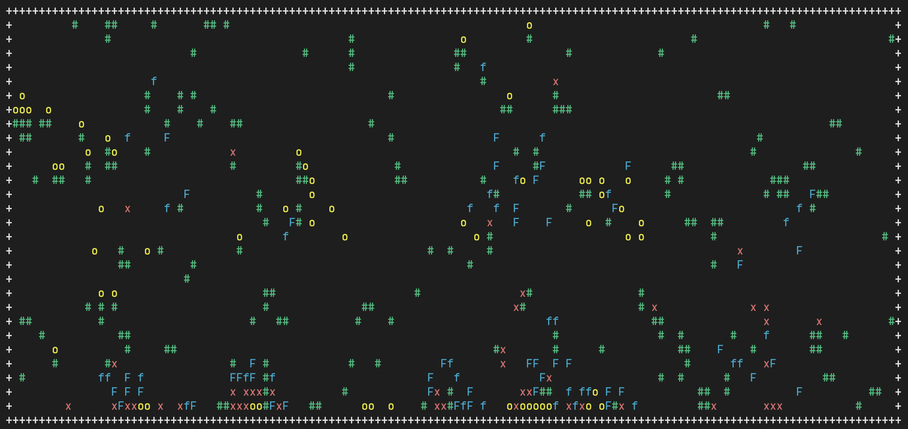

# Virtual Fish Tank

This Python program simulates a virtual fish tank with fish, food, rocks, and dead fish. The fish tank is displayed in the terminal, with different colors representing various objects in the tank. Fish move around the tank to consume food and reproduce, while dead fish drift down and eventually decompose into food.

## Powered by OpenAI's ChatGPT

This virtual fish tank simulation is a result of the collaboration with OpenAI's cutting-edge language model, ChatGPT. ChatGPT, a product of the advanced GPT-4 architecture, generated the code and designed the program by providing insights, suggestions, and code snippets throughout the development process.

With ChatGPT's help, the code was crafted by leveraging its vast knowledge and understanding of Python programming and concepts. By combining the power of AI with human supervision, we brought the virtual fish tank to life, showcasing the endless possibilities that can be achieved when AI takes the lead in software development.

The synergy between human supervision and AI's computational prowess has made this virtual fish tank simulation not only an engaging and fun experience but also a testament to the future of AI-driven programming. Experience the magic of AI-generated code as you explore the depths of this virtual fish tank and watch its inhabitants thrive within their dynamic, ever-changing environment.

This README.md was written solely by ChatGPT, demonstrating the capabilities of AI language models in generating comprehensive documentation.

## Features

- Terminal-based graphical display using the `colorama` library.
- Random object spawning for fish, food, and rocks.
- Fish move towards the closest food or other fish, depending on their energy level.
- Fish consume food to gain energy and reproduce when they meet certain conditions.
- Dead fish drift down towards the bottom of the tank and decompose into food after a certain time.
- Food drifts down towards the bottom of the tank, avoiding rocks and other objects.
- New food spawns at the top of the tank every set number of iterations.
- Tank size adapts to the terminal size.
- Tank statistics (number of fish, number of food, iterations, fish births, fish deaths, average fish energy) are displayed at the bottom of the tank.

## Installation

1. Clone the repository:

`git clone https://github.com/nicholasjconn/GPT-FishTank.git`

2. Change to the `GPT-FishTank` directory:

`cd GPT-FishTank`

3. Install the required dependencies:

`pip install -r requirements.txt`

## Usage

Run the virtual fish tank simulation by executing:
`python main.py`

### Windows and Linux

To stop the simulation, press `Ctrl+C` (`Control+C` on Mac).

## Future Enhancements

1. **Add comments and docstrings**: Include clear comments and docstrings explaining the purpose of each class, method, and variable.
2. **Improve code organization**: Refactor the code into separate files (e.g. `fish.py`, `tank.py`, etc.) and use classes for better code organization and maintainability.
3. **User Interraction**: Develop a text-based user interface that lets users interact with the simulation by pausing, resuming, or modifying parameters like fish reproduction rate, mortality rate, and food generation rate. Add error handling and validation for input parameters, such as tank dimensions.
4. **Optimize performance**: Identify and optimize performance bottlenecks, especially in the `run` method and object searching. Implement a more efficient data structure for managing the objects in the tank, such as a spatial partitioning data structure (e.g., quadtree).
5. **Statistics and Visualization**: Design a system that monitors and presents data on the current population, food count, and other relevant statistics over time. This feature would help users observe the evolution of the fish tank ecosystem, providing insights on the oldest fish and average fish age.
6. **Different Fish Species**: Introduce various fish species with unique characteristics, such as energy consumption, reproduction rate, and movement speed, to increase the simulation's complexity and engagement.
7. **Predator Fish**: Create a PredatorFish class that can only consume other fish, specifically non-predatory fish, and cannot eat Food. Predator fish should avoid schooling and only interact with one another for mating purposes when they have sufficient energy.
8. **Predator-Prey Interaction**: Add predators that hunt and consume fish to create a more dynamic environment and highlight interactions between different species.
9. **Implement a GUI**: Develop a graphical user interface (GUI) to make the simulation more visually appealing and user-friendly.
10. **Improve fish behavior**: Improve fish AI, such as adding better decision-making for food searching or avoiding obstacles.
11. **Enhance rock generation**: Improve the algorithm for generating rocks in the tank, ensuring a more realistic and aesthetically pleasing environment.
12. **Include unit tests**: Add unit tests to ensure that the code is functioning correctly and to make future development more reliable.

## Change Log

### v1.1.0

- Improved frame rate consistency for smoother simulation performance
- Modified food distribution to form clumps instead of being uniformly spread across the tank
- Introduced an age attribute to TankObject, adjusting reproduction and energy consumption based on age
- Altered rock placement to form clusters, creating more structured environments
- Established a parent class for Fish to enhance extendability
- Enabled fish to change characters with age (e.g., 'f' to 'F')
- Refined the Fish move method, factoring in fish neighbor count to promote schooling behavior
- Ensured fish reproduction occurs only in the presence of other fish
- Implemented an eating cooldown to prevent rapid food consumption and hoarding
- Incorporated minor simulation improvements for overall performance enhancement
- Added more Chat-GPT generated suggestions for next steps, ranked by Chat-GPT based on the ease of implementation and importance.

## Human Commentary

This experiment started as a way for me to test Chat-GPT for code generation. This is a powerful stress test for seeing how complex a program can get before Chat-GPT struggles to make changes as directed. I've been very impressed with Chat-GPT 4, which significantly outperformed Chat-GPT 3 in these tests. I will continue to have Chat-GPT add features and update the code until the written code becomes unusable or poorly designed based on my judgement. In the future, I plan to go through this process each time a new version of Chat-GPT is released.

## License

This project is licensed under the MIT License - see the [LICENSE](LICENSE) file for details.
